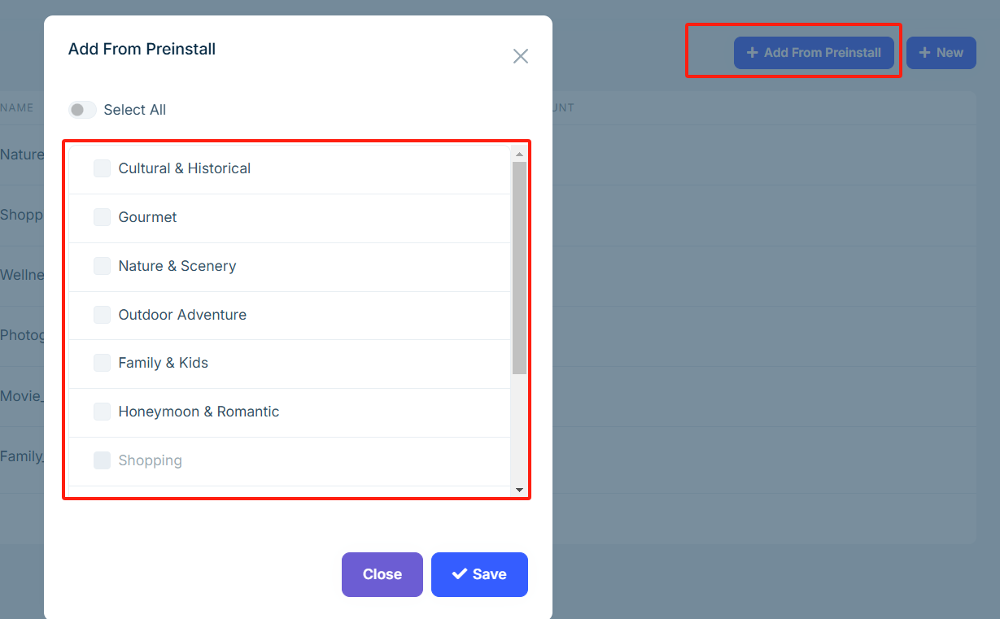
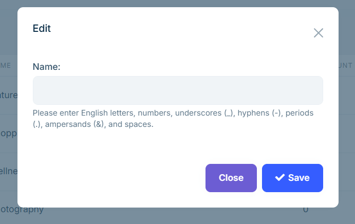

# Categories and Areas

**Categories** and **areas** help clearly organize tour projects, making it easier for customers to search and filter tours. You can configure them flexibly in the admin panel to improve the browsing and booking experience.

## Editing

In the admin panel, go to `Tour Management` > `Area` to perform the following actions:

- Click **Add from Presets** in the top-right corner to choose from system preset areas.  
  

- Click the **New** button to manually input an area name in the popup dialog.  
  

**Note**: Only English input is supported at this time. Multilingual support is not available. Names can include letters, numbers, spaces, underscores `_`, hyphens `-`, and ampersands `&`.

In the `Category` page, the operations are the same as in the `Area` page.

## Display

The configured category and area information will appear on the frontend in the following modules:

- The **Featured Tours** section on the homepage.

- The filter panel on the **Tours** page.

- The category and area tags on each **Tour Details** page.

These elements help customers quickly find tours that match their interests.

---

Properly configuring categories and areas optimizes website structure and improves search efficiency. It is recommended to set them during tour creation to ensure accurate and complete display on the frontend.
