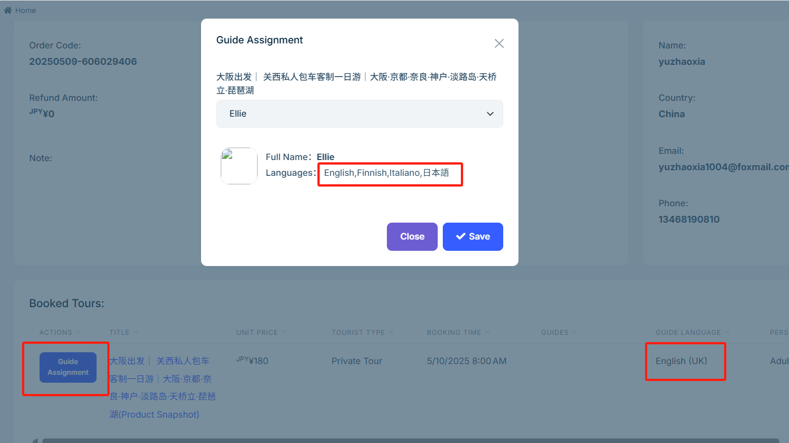

# Assigning a Tour Guide

To ensure customers have a great tour experience, the system allows you to assign an appropriate tour guide for each tour based on the language selected during booking. This guide will help you efficiently complete guide assignment, notifications, and follow-up communication.

## Guide Language

The guide language is the main language used by the guide to communicate with the customer. When assigning a guide, be sure to match the customer's selected language to ensure smooth communication.

Customers will select their preferred guide language during booking. Once the order is generated, you can assign a guide with the appropriate language skills to each **paid** tour from the admin panel under **Order Management**.

## Guide Notification Email

Once a guide has been assigned, the system will automatically send an email containing order information to the guide, notifying them that they have been scheduled to receive a customer.

## Guide Confirmation with Customer

After receiving the email, the guide should promptly contact the customer using the phone number or email provided to confirm the meeting time, location, and other pre-tour arrangements to ensure the tour goes smoothly.

---

Properly assigning guides and ensuring timely communication are key to delivering high-quality service. Please carefully match the guide to the customer’s language preferences to ensure a professional and seamless experience. For more details, please refer to related help documents.
