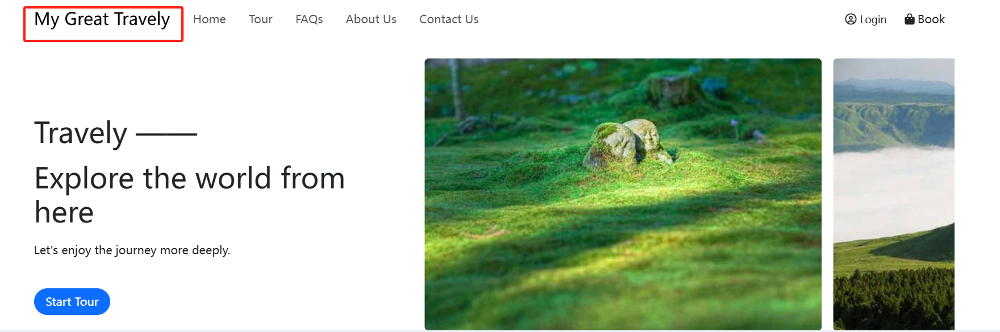
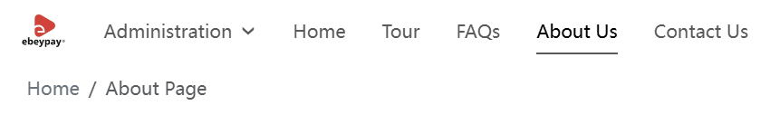
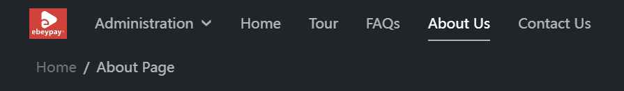

# Brand Settings

To create a unified and professional visual identity, you can set the brand name, logo, inverse logo, and site icon (Icon) in the backend. These brand elements will be displayed in multiple locations on the website front end, helping users quickly recognize and remember your brand.

## Brand Name

The brand name set here will be displayed at the top of website pages, helping users quickly identify the website’s affiliation:

## Logo Settings

The brand logo is an important part of the brand image. The system will display your logo in the following locations:

- To the left of the brand name in the website’s top navigation bar;
- On the bottom left of the website footer.

## Inverse Logo

The inverse logo is suitable for dark backgrounds, ensuring the logo remains clearly visible and maintains visual consistency across different backgrounds.

**On white backgrounds,** the default logo is displayed:

**On black backgrounds,** it automatically switches to the inverse logo:

It is recommended to upload an inverse version that matches the default logo style with clear color contrast.

## Site Icon (Icon)

The icon is a functional recognition symbol commonly used for browser tabs, shortcuts, and more. It is different from the logo (brand identification) but equally important.

- Recommended formats: ICO, PNG, SVG
- Recommended size: 16px × 16px

After completing the brand settings, your website will present a more professional and consistent visual image, helping to enhance user trust and brand recognition. If you need to update brand information later, you can modify it anytime in the backend, and all changes will be synchronized to the website front end in real time.
