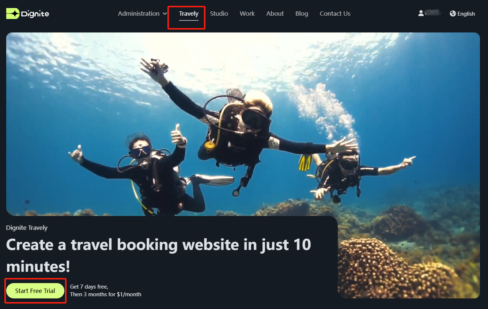
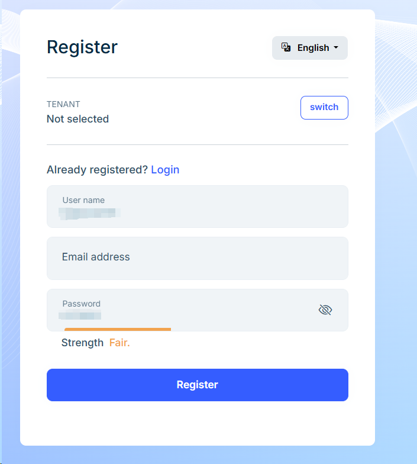
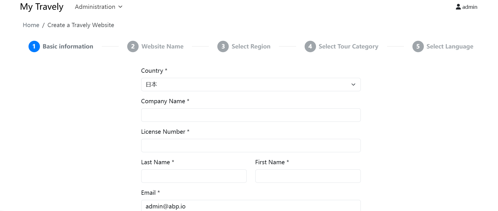
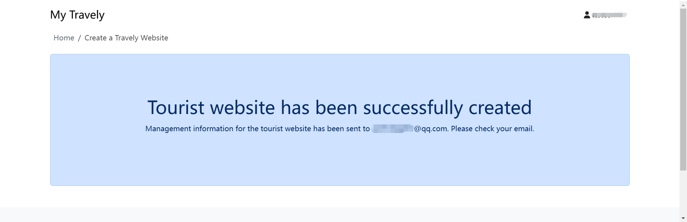
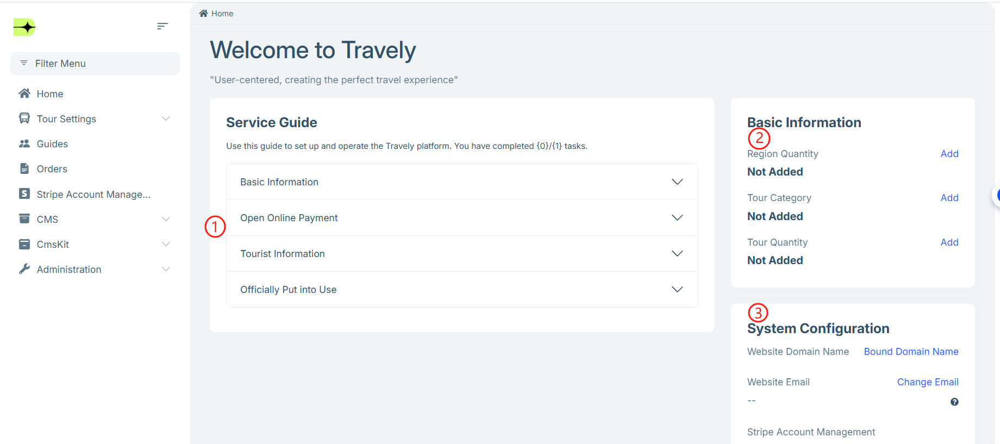

# Launching Your Travel Website

To help travel service providers quickly build and operate their own travel websites, Dignite offers a convenient and efficient platform. Through simple registration, information entry, and configuration steps, you can have a professional travel website that supports multiple languages, online booking, and payments — all without any programming skills. This guide will walk you through the entire launch process, from account registration to backend configuration, ensuring a smooth start and client reception.

## Launch Steps

Please complete the website launch by following these steps:

1. **Launch Entry**

   - Visit the [official website](https://dignite.com), go to the **Travel** section, and click [Launch Now](https://dignite.com/zh-Hans/travely) to start creating your travel website.
     

2. **Login/Register**

   - If you already have an account, please log in directly.
   - If not, click the **Register** button and follow the prompts to complete registration, or use your Google account for quick login.
     

3. **Fill in Information**

   - Basic information about your service.
   - Name your website.
   - Select service regions.
   - Choose travel types.
   - Select language preferences.

     

4. **Submit Information**

   - At the final step, click **Finish**, then review the page, and click the **Submit** button if all information is correct.
     

Once submitted successfully, the system will send an email to your registered address containing the backend login URL, account, and initial password.

---

## Accessing the Backend

After entering the backend management system, please follow the homepage instructions to complete the necessary configurations.

> **Note:** The website is considered **officially launched** only after the **Website Domain**, **Website Email**, and **Online Payment** configurations are completed on the homepage.

### Service Guide

- **Basic Information**  
  This matches the "Basic information about your service" you provided during launch. You can supplement or edit it here.

- **Online Payment**  
  Please prepare a Japanese mobile phone number in advance for account verification and two-factor authentication to enhance account security. Phone numbers from other countries are not supported.  
  Follow the instructions to complete the online payment setup, which is critical for receiving payments. See [Online Payment](Online-Payment.md) for detailed instructions.

- **Travel Information**  
  For specific operations, please refer to the **Travel Management** guide.

### Basic Information

The information you fill in under the **Basic Information** section in the Service Guide will be displayed here and can be modified anytime.

### System Configuration

- **Website Domain**  
  You can customize your website domain. See [Domain Settings](Domain-Settings.md) for details.

- **Website Email**  
  You can modify the site email address, which is used to receive system notifications and send emails to clients and guides. To ensure smooth email delivery and better protect your email password, see [Email Settings](Email-Settings.md) for related configurations.

- **Account Management**  
  This is consistent with the **Online Payment** setup in the Service Guide.

- **Website Language**  
  Supports multi-language settings. Click the `Language Management` button on the right to select allowed language versions for your site.

At this point, you have completed the launch and basic setup of your travel website.  
If you encounter any problems during the process, please refer to the detailed documentation for each module.  
Wishing you great success in your digital travel business!
