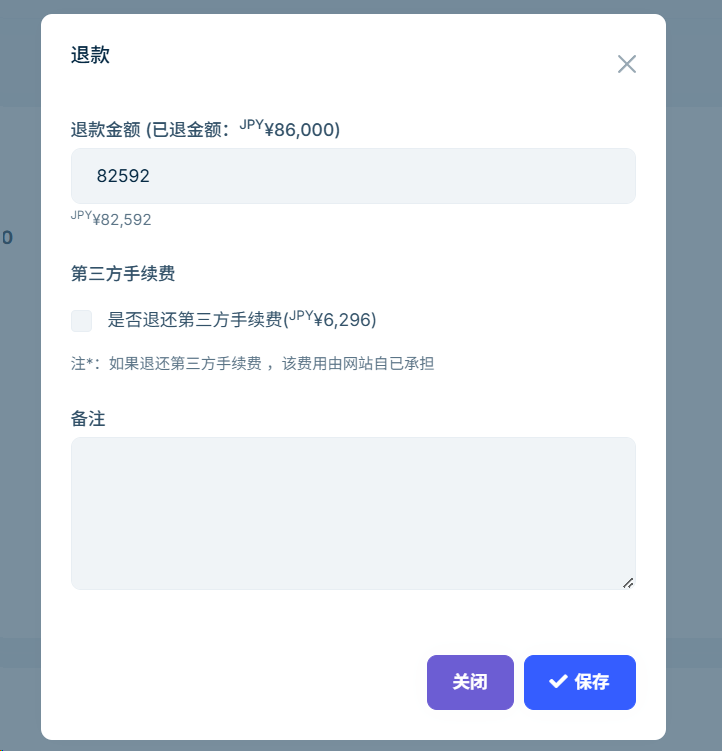

# Customer Refund

Refund amounts are automatically calculated by the system, requiring no manual intervention. When a customer initiates a refund, the system will send a refund notification email on your behalf. This guide helps you understand the refund process, calculation rules, and important notes to ensure a smooth and efficient refund experience, improving customer service.

## Snapshot Description

The system automatically saves a **snapshot** of the tour page when the customer places an order, including the title, price, description, images, and other information. You can view the snapshot by clicking the **title** in the **Booked Tours** list on the order details page in the backend.

## Refund Timing

Whether a refund is allowed depends on the **refund policy** time settings for each tour in the order.

## Refund Methods

- **Customer-Initiated Refund:** Customers can log in to the website and click the **Refund** button in their order details to submit a refund request directly.
- **Merchant-Initiated Refund:** Customers may also contact you via phone or email provided on the website. You can find the corresponding order number in the backend **Orders** list, enter the details page, and click the **Refund** button to process the refund request.

  > Note: Each order supports only one refund request from the customer on the website, but you can initiate multiple refunds from the backend.

  

## Fees Explanation

- Refunds initiated from the website do not include third-party platform (Stripe) fees.
- Refunds processed in the backend can include refunding third-party fees, the exact amount depending on Stripe's fee policy.

## Refund Records

All refund operations and amounts can be viewed in the refund information list on the backend order details page.

---

Please carefully verify the order information and refund policies before processing any refunds, and keep proper records of each refund.
