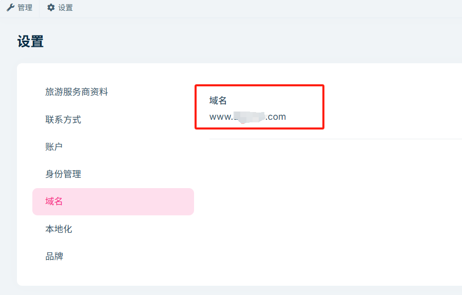
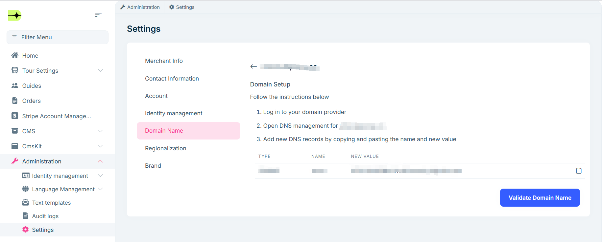

# Domain Settings

To enhance your website’s professional image and ease of access, it is recommended to configure a custom domain for your site. This guide will help you quickly complete domain selection and DNS configuration to ensure your domain correctly points to your website and functions properly.

## Custom Domain Name

**Domain Selection**

- **Short and Memorable**  
  Try to use a simple and easy-to-type domain name, avoiding overly long or complex character combinations.
- **Brand Relevance**  
  Choose a domain that relates to your website’s theme or brand to improve recognition and memorability.
- **Language Adaptation**  
  Use English keywords mainly, selecting based on the language habits of your target audience.

## DNS Configuration

1. When adding a domain for the first time, you need to purchase a domain from a **domain registrar** and follow their steps to complete DNS setup. The following example uses [Onamae.com](https://www.onamae.com/) to explain how to configure DNS records.

   **Purchasing a Domain:**  
   - Visit the [Onamae.com](https://www.onamae.com/) official website and register or log in to your account.  
   - Enter the desired domain name and suffix in the search box to check availability.  
   - If available, add it to the cart, fill in registration details, and complete the payment.

   **Setting DNS:**  
   - Log in to your [Onamae.com](https://www.onamae.com/) account and go to the management center.  
   - Click the first option in the navigation bar and select `Set Name Server`.  
   - Choose the domain you want to modify and click `Other`.  
   - Enter the custom DNS server addresses and click `Verify`.

2. For subsequent changes to your custom domain, please update the DNS records as shown below:

**Note:** If you use a domain proxy service like Cloudflare, domain verification might fail. Please pause the proxy during verification, then reactivate it after verification succeeds.

> After domain configuration is complete, the system will automatically check if the domain is available and bind it to your website.

## Preview

Once successfully configured, your website will be accessible via the new custom domain, as shown below:

By configuring a custom domain, you not only improve the professionalism of your site but also enhance brand recognition and visitor experience. If you encounter any issues during setup, we recommend contacting your domain registrar’s customer support for assistance.
