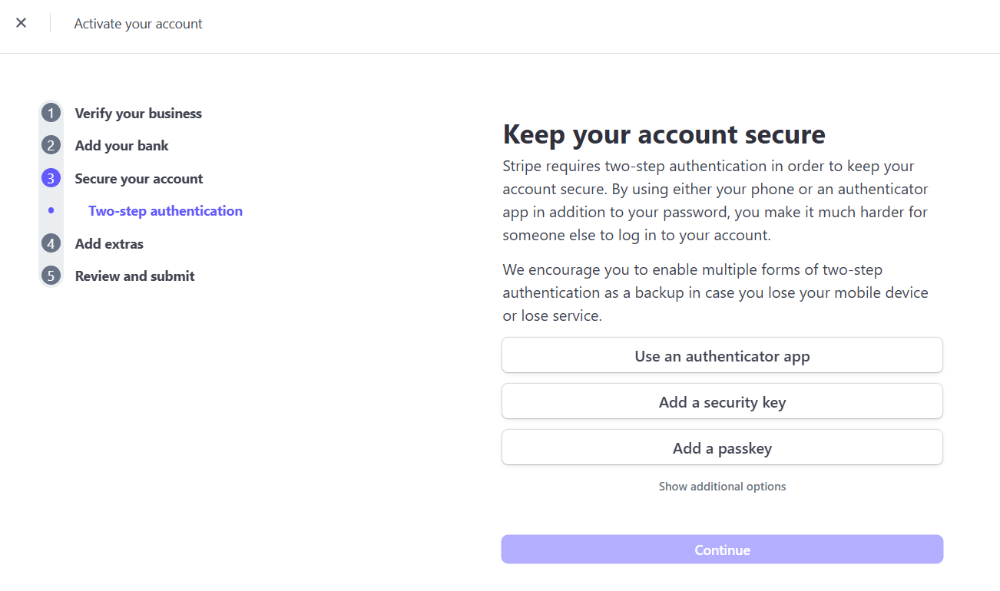

# Payment Account

To help you receive customer payments securely and efficiently, **Dignite Travely partners with Stripe**, offering a reliable and high-performance payment service solution. This page will guide you through setting up your payment account and explain related features.

> Stripe is a leading global payment processor that provides secure and convenient payment solutions for various online platforms.

## Activate Online Payments

Go to the **Service Guide** section on the homepage and click **Activate Online Payment**, then follow the steps below to create and activate your Stripe account:

### 1. Verify Email Address

- Visit the [Stripe official website](https://stripe.com/en-jp)
- Click **Sign Up** and fill in your basic information (email, password, etc.)
- After verifying your email, log in to your account

### 2. Use Sandbox Mode for Testing

- Stripe offers a sandbox environment for testing, where you can preview account balances, transactions, and customer information
- You can explore these features without performing real payment operations

### 3. Activate Your Live Account

To activate your live Stripe account, you can:

- Click **Get Your Live Account** at the top right in the sandbox
- Or use the **Finish Setup Guide** at the bottom right

Fill in your company/personal information as instructed to complete account activation.

**Important Notes:**

1. **Two-factor authentication** must use a **Japanese phone number**. Other country numbers are not supported.

2. The **business name** you provide in Stripe should match your **website name**

3. Your travel product pages must be properly filled in before Stripe can approve your account

4. Japanese law requires your site to include a link labeled **特定商取引法に基づく表記** (Specified Commercial Transaction Act Notice)

## Admin Panel: Stripe Features

Once Stripe is activated, go to the **Stripe Account** section in the left sidebar of the admin panel:

### Account Login

- Log into your Stripe account to complete identity verification
- Once verified, Stripe payments will be officially enabled

### Withdrawal History

- View records of withdrawals, including date, amount, and status

### Payment Details

- Track detailed records of each customer payment for financial management

### File Downloads

- Download documents related to your payment account

### Tax Information

- Enter or update your tax address and tax ID to ensure compliance

Once your Stripe payment account is set up, you’ll be able to receive payments, manage finances, and ensure compliant, secure transactions. If you encounter issues during setup, refer to Stripe's off
