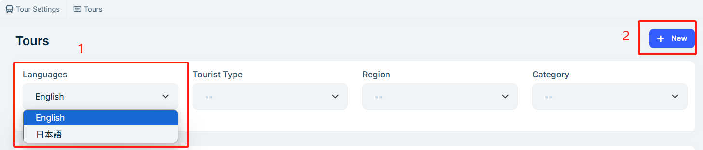

# Tours

The **Tour** module is the core content display area of your travel website. You can easily add itineraries, configure booking information, and manage language versions through the admin panel, providing your customers with a clear and convenient browsing and booking experience.

## Editing a Tour

Go to **Add/Edit Tour** in the admin panel.

Before editing a tour item, first select the desired language version, then proceed to the edit page.  
For example:  
- Select Japanese → fill in content in Japanese  
- Select English → fill in content in English  
Repeat accordingly for other languages.

1. **Itinerary**
   - Map Selection  
     On the **Add/Edit Tour** page, select the service region for this itinerary on the right.
     

     In the **Itinerary Address** section, enter the location name, then click the **Select** button. A map will pop up for location confirmation. After choosing the correct spot, click confirm.
     

     The selected map location will be displayed on the frontend tour detail page for customer reference.  
     Each itinerary can have one map location; each tour may include multiple itinerary points.

2. **Booking Dates**
   - Advance Booking Days  
     Example: 0 means same-day booking is allowed. If the last bookable date is the day after tomorrow, the advance booking is 2 days.

   - Booking Time Type
     - Specific Dates  
       Manually set bookable dates like 2025-06-01, 2025-06-04, 2025-06-07, etc.
       

     - Specific Period  
       Set date ranges by year/month/week. For example:  
       Day 230 to 300 each year, Day 10 to 20 each month, or Day 5 to 7 each week.
       

     - No Time Limit  
       No end time set; bookings are accepted indefinitely from today.

## Viewing Tours

After completing the edit, you can view the published tours on the website, including card previews and detail pages.

1. Itinerary  
   Customers can view your set itinerary points and sequence to clearly understand the route.
   

2. Refund Policy  
   The **Refund Policy** set in the admin will be shown when customers initiate a refund, and the system will auto-calculate the refundable amount.

3. Booking Dates  
   The frontend will display selectable dates based on the backend booking settings.
   

You now understand how to create and manage tour content. Please ensure all information is accurate and complete to enhance the customer experience. For further questions, refer to other help documents.
