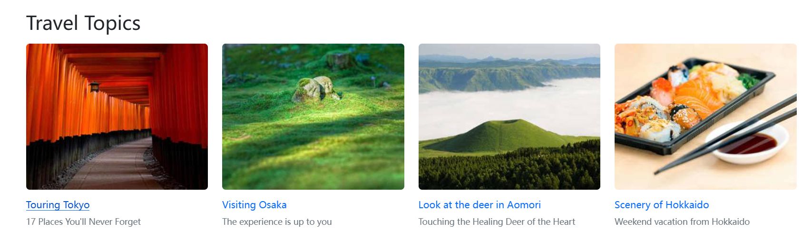

# Website Pages

The Website Pages module allows you to customize key content pages such as the Homepage, About Us, and Contact Us. This helps showcase your brand, improve customer experience, and enhance visibility on search engines. This guide will walk you through how to edit page content and configure basic SEO information.

## Page Editing Access

Navigate to the page editing interface via **Content Management** on the left sidebar of the admin panel.

Page content consists of two main modules:

## 1. Input Field Content Editing

You can freely edit content for Homepage, About Us, and Contact Us based on predefined input fields.

### Homepage

1. **Site Slogan**  

   Enter the slogan using the rich text editor. It will be displayed at the top of the homepage.  
   

2. **Banner Advertisement**  

   Set a main title, subtitle, and full-width image. The link is fixed. The banner appears at the bottom of the homepage.  
   

3. **Tour Topics**  

   Enter highlights of different regions to help users browse and filter tours efficiently.  
   

4. **Recommended Tours**
  
   This module displays featured tours to increase exposure and boost booking conversions.  

### About Us

1. Company Slogan  
2. Company Introduction  
   - Text content  
   - Image gallery  

### Contact Us

1. Slogan  
2. Company Name  
3. Email Address  
4. Postal Code  
5. Company Address  
6. Google Map URL  
7. Social Media Links  

## 2. SEO Settings

SEO (Search Engine Optimization) helps improve your site's visibility in search results. Editable fields include:

- **Page Title**  
  Displayed as the title in search engine results. Keep it concise and informative.

- **Page Description**  
  A short summary shown below the title in search results. Should be clear and engaging.

- **Page Image**  
  Upload a representative and visually attractive image to enhance appearance in search previews.

> Note: Under **Content Management** > **Settings**, default configurations are applied and do not require manual changes.

---

By setting up content and SEO information properly, you can enhance your website’s presentation, increase user trust, and improve search engine rankings.
