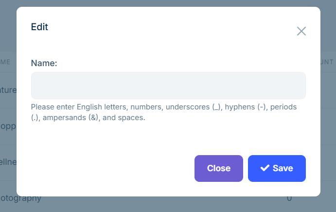

# 種類と地域

**種類**と**地域**を設定することで、ツアーを分かりやすく分類し、お客様が目的のツアーを素早く検索・絞り込めるようになります。管理画面から柔軟に設定可能で、サイトの閲覧・予約体験の向上につながります。

## 編集

管理画面の左メニューから`ツアー管理` > `地域`に進み、以下の操作ができます：

- 右上の【プリセットから追加】をクリックし、システムに用意された地域を選択します。  
  

- 【新規作成】ボタンをクリックして、ポップアップで地域名を手動入力します。  
  

**注意**：現在、入力は英語のみ対応しています。多言語入力には未対応です。名前には、アルファベット、数字、スペース、アンダースコア `_`、ハイフン `-`、およびアンパサンド `&` などを含めることができます。

`種類`ページの操作方法は、`地域`ページと同様です。

## 表示

設定された種類と地域は、フロントサイトで以下のモジュールに表示されます：

- トップページの**特集ツアー**セクション

- **ツアー**ページの絞り込み条件

- **ツアー詳細**ページの種類・地域ラベル

これらの情報は、お客様が興味のあるツアーを素早く見つけるのに役立ちます。

---

種類と地域を適切に設定することで、サイト構造が整理され、検索効率が向上します。ツアー作成時にあわせて設定することをおすすめします。
