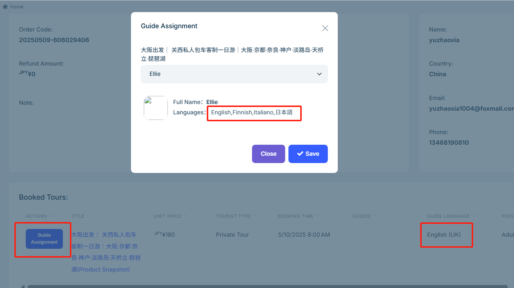

# ガイドの手配

お客様に快適なツアー体験を提供するために、システムでは予約時に選択された言語に基づいて、各ツアーに適切なガイドを割り当てることができます。本ガイドでは、ガイドの割り当て、通知、およびその後の連絡手順についてご案内します。

## ガイドの使用言語

ガイドの言語とは、お客様とのコミュニケーションに使用する主な言語のことです。ガイドを手配する際は、お客様が選択した言語に必ず対応させ、円滑なコミュニケーションを確保してください。

お客様は予約時に希望するガイドの言語を選択します。注文が生成された後、管理画面の【注文管理】から、**支払い済み**の各ツアーに対して対応言語を話せるガイドを割り当てることができます。

## ガイドへのメール通知

ガイドの割り当てが完了すると、システムからガイドに自動的にメールが送信され、該当注文に割り当てられたことが通知されます。

## ガイドからの連絡確認

ガイドはメールを受け取った後、記載されているお客様の連絡先（電話番号またはメールアドレス）を使って、集合時間・場所・その他の事前準備について速やかに確認を行ってください。これにより、ツアーが円滑に進行します。

---

ガイドの適切な手配と迅速なコミュニケーションは、高品質なサービスを提供するための鍵です。お客様の言語ニーズに合わせてガイドを慎重に選定し、常にスムーズで専門的な対応を心がけてください。詳細は関連ヘルプドキュメントをご参照ください。
