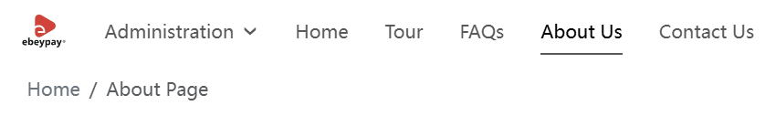

# ブランド設定

統一感がありプロフェッショナルなビジュアルイメージを構築するために、管理画面でブランド名、ロゴ、反転ロゴ、およびサイトアイコン（Icon）を設定できます。これらのブランド要素はサイトの複数の場所に表示され、ユーザーがブランドを迅速に認識し記憶するのに役立ちます。

## ブランド名

ここで設定したブランド名は、サイトのページ上部に表示され、ユーザーがサイトの所属を素早く識別できます：

## ロゴ設定

ブランドロゴはブランドイメージの重要な要素であり、システムは以下の位置にロゴを表示します：

- サイト上部のナビゲーションバーでブランド名の左側
- サイト下部の左側

## 反転ロゴ

反転ロゴはダーク背景に適しており、異なる背景色でもロゴがはっきりと見え、視覚的一貫性を維持します。

**白背景の場合** は通常のロゴを表示：

**黒背景の場合** は自動的に反転ロゴに切り替わります：

デフォルトのロゴスタイルと一致し、色のコントラストがはっきりした反転ロゴのアップロードを推奨します。

## サイトアイコン（Icon）

Icon は機能を識別するアイコンで、ブラウザのタブやショートカットアイコンなどに使用されます。ロゴ（ブランド識別）とは異なりますが、同じく重要です。

- 推奨フォーマット：ICO、PNG、SVG
- 推奨サイズ：16px × 16px

ブランド設定を完了すると、サイトはよりプロフェッショナルで一貫したビジュアルイメージを呈し、ユーザーの信頼とブランド認知度の向上に役立ちます。ブランド情報の更新が必要な場合は、いつでも管理画面で変更でき、すべての変更はリアルタイムでサイトに反映されます。
