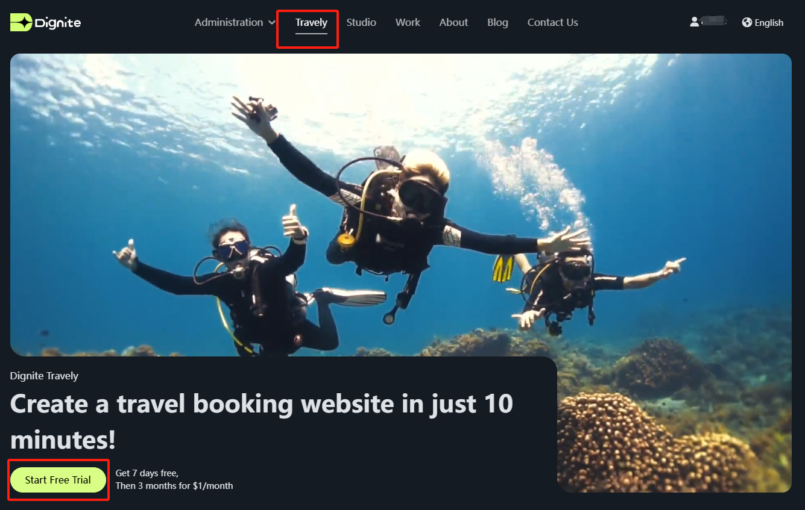
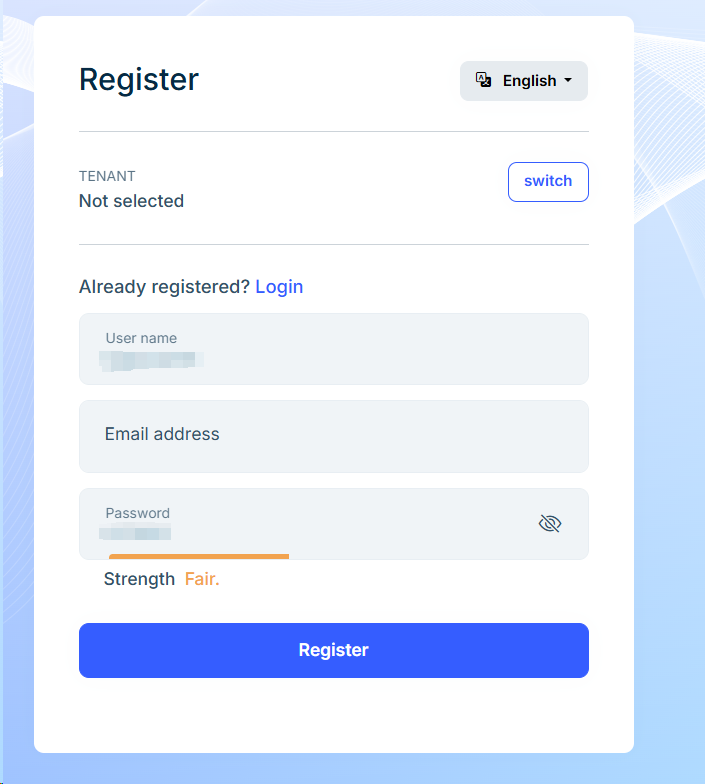
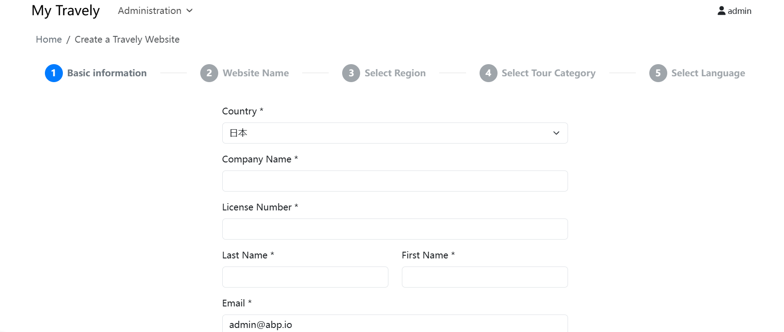
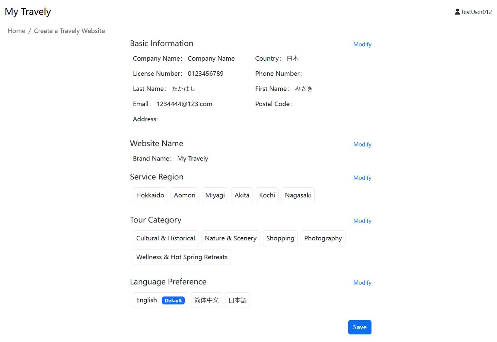
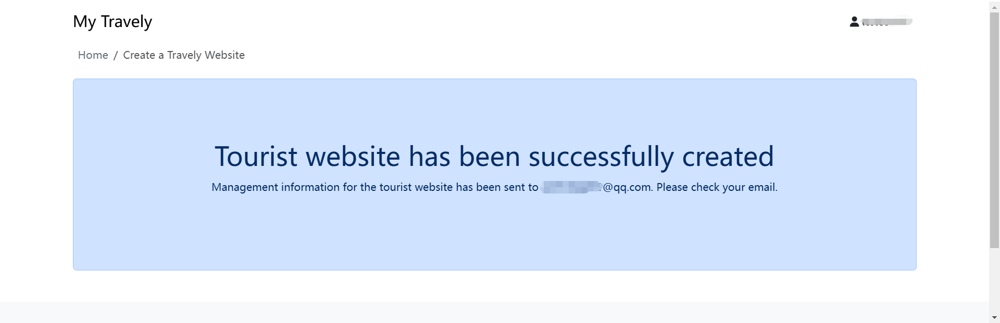
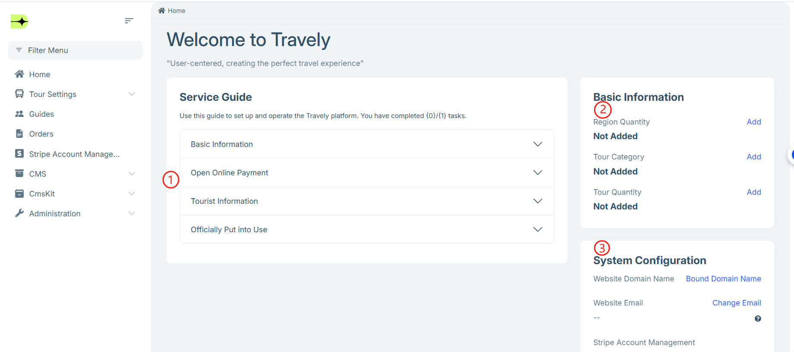

# 旅行サイトの開設

旅行サービス提供者が自分の旅行サイトを迅速に構築・運営できるよう、Dignite は便利で効率的な構築プラットフォームを提供しています。簡単な登録、情報入力、設定ステップを通じて、プログラミング不要で多言語対応、オンライン予約・決済が可能なプロフェッショナルな旅行サイトを持つことができます。本ガイドではアカウント登録から管理画面の設定まで、スムーズにサイト開設し顧客を受け入れられるようにステップごとに説明します。

## 開設手順

以下の手順に従い、旅行サイトの開設を完了してください。

1. **開設入口**

   - [公式サイト](https://dignite.com)にアクセスし、**旅行** モジュールへ進み、[今すぐ開設](https://dignite.com/zh-Hans/travely)をクリックして旅行サイトの作成を開始します。  
     

2. **ログイン／登録**

   - 既にアカウントをお持ちの場合は、直接ログインしてください。  
   - 未登録の場合は、**登録** ボタンをクリックし、案内に従って登録を完了するか、Googleアカウントでの簡単ログインを利用してください。  
     

3. **情報入力**

   - サービス提供者の基本情報  
   - サイト名の設定  
   - サービス提供地域の選択  
   - 旅行タイプの選択  
   - 言語設定の選択  

     

4. **情報の送信**

   - 最終ステップで **完了** をクリックし、内容を確認後、**送信** ボタンを押してください。  
     

送信が成功すると、登録メールアドレスに管理画面のログインURL、アカウント、初期パスワードを記載したメールが届きます。  

---

## 管理画面へのアクセス

管理画面にログイン後、ホームページの指示に従って必要な設定を行ってください。

> **注意:** ホームページで**サイトドメイン**、**サイトメール**、**オンライン決済**の設定が完了して初めて**正式開設**と見なされます。

### サービスガイド

- **基本情報**  
  開設時に入力したサービス提供者の基本情報と同じ内容です。ここで補足・修正が可能です。

- **オンライン決済**  
  日本の携帯電話番号を事前にご用意ください。アカウント認証および二段階認証に使用し、セキュリティを強化します。他国の電話番号は使用できません。  
  収款に非常に重要なため、案内に従いオンライン決済設定を完了してください。詳細は[オンライン決済](Online-Payment.md)をご参照ください。

- **旅行情報**  
  詳細な操作は**旅行管理**の操作説明をご確認ください。

### 基本情報

サービスガイド内の基本情報欄で入力した内容が表示され、いつでも変更可能です。

### システム設定

- **サイトドメイン**  
  サイトのドメインをカスタマイズできます。詳細は[ドメイン設定](Domain-S)
