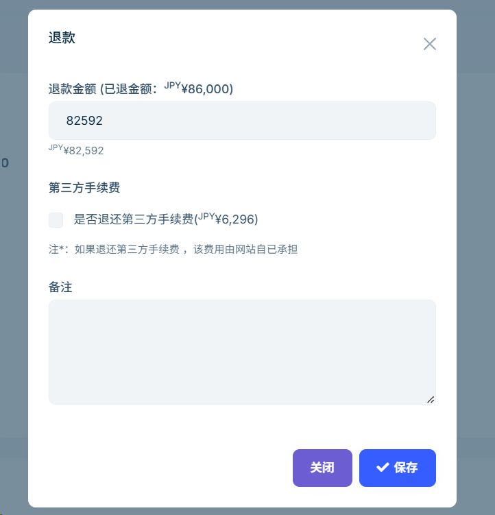

# 顧客の返金

返金金額はシステムによって自動計算され、手動での操作は不要です。顧客が返金を申請すると、システムはあなたの名義で返金通知メールを送信します。本ガイドは、返金処理の流れ、計算ルール、注意点を理解し、スムーズかつ効率的な返金対応を実現し、顧客サービスの向上を支援します。

## スナップショット説明

顧客が注文をした時点で、システムはツアーページの**スナップショット**（タイトル、価格、説明、画像など）を自動保存します。管理画面の【注文】詳細ページ内の【予約したツアー】リストにある**タイトル**をクリックすると、該当注文のページスナップショットを確認できます。

## 返金可能期間

返金の可否は、注文内の各ツアーで設定された**返金ポリシー**の期間に基づき決定されます。

## 返金方法

- **顧客自身による返金申請：** 顧客はウェブサイトにログインし、注文詳細ページの【返金】ボタンをクリックして返金申請を行えます。
- **事業者による返金処理：** 顧客がサイトに記載された電話やメールで連絡してきた場合、管理画面の【注文】一覧から該当注文番号を探し、詳細ページに入り【返金】ボタンをクリックして返金処理を行えます。

  > 注意：サイト上では各注文につき顧客からの返金申請は1回のみですが、管理画面からは事業者側が複数回返金処理を行うことが可能です。

  

## 手数料について

- ウェブサイトからの返金には第三者プラットフォーム（Stripe）の手数料は含まれません。
- 管理画面からの返金は第三者手数料の返金も可能で、具体的な金額はStripeの料金ポリシーに依存します。

## 返金記録

すべての返金操作および金額は、管理画面【注文】詳細の返金情報リストで確認できます。

---

返金処理を行う際は、注文情報および返金ポリシーを十分に確認し、すべての返金記録を適切に保管してください。
