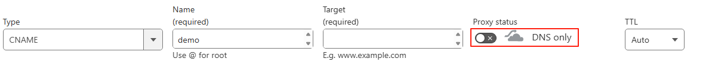
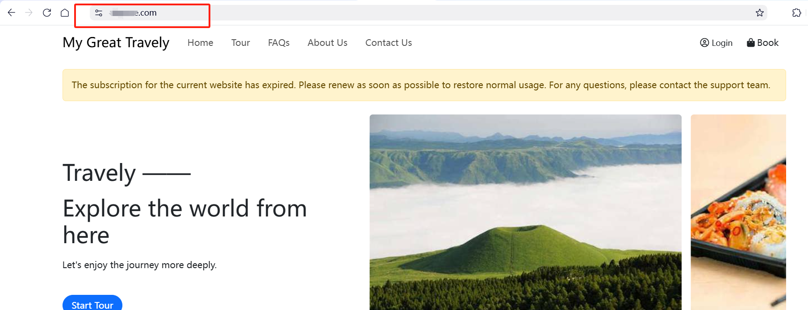

# ドメイン設定

ウェブサイトのプロフェッショナルなイメージとアクセスの利便性を高めるために、カスタムドメインの設定をおすすめします。本ガイドでは、ドメイン選択とDNS設定を迅速に完了し、ドメインが正しくウェブサイトを指し示し正常に動作するようにする方法を説明します。

## カスタムドメイン名

**ドメインの選び方**

- **短く覚えやすい**  
  簡潔で入力しやすいドメイン名を使い、長すぎたり複雑な文字列は避けましょう。
- **ブランド関連性**  
  サイトのテーマやブランドに関連するドメインを選び、認知度と記憶度を高めましょう。
- **言語対応**  
  英語を主なキーワードとして使用し、ターゲットの言語習慣に合わせて選択してください。

## DNS設定

1. 初めてドメインを追加する場合、【ドメイン登録事業者】でドメインを購入し、その手順に従ってDNS設定を行う必要があります。以下は [Onamae.com](https://www.onamae.com/) を例にDNSレコードの設定方法を説明します。

   **ドメイン購入：**  
   - [Onamae.com](https://www.onamae.com/) の公式サイトにアクセスし、アカウントを登録またはログインします。  
   - 希望のドメイン名とサフィックスを検索ボックスに入力し、登録可能か確認します。  
   - 登録可能ならカートに追加し、登録情報を入力して支払いを完了させます。

   **DNS設定：**  
   - [Onamae.com](https://www.onamae.com/) にログインし、管理センターにアクセスします。  
   - ナビゲーションバーの一番目の項目をクリックし、「ネームサーバー設定」を選択します。  
   - DNSを変更したいドメインを選び、「その他」をクリックします。  
   - カスタムDNSサーバーのアドレスを入力し、「確認」をクリックします。

2. カスタムドメインを後から変更する場合は、下図の指示に従ってDNSレコードを更新してください。

**注意：** Cloudflareのようなドメイン解析プロキシを利用していると、ドメイン認証に失敗する場合があります。認証が通るまでプロキシを一時停止し、認証後に再度有効化してください。

> ドメイン設定が完了すると、システムが自動でドメインの使用可能状況を確認し、ウェブサイトに紐づけます。

## プレビュー

設定が成功すると、新しいカスタムドメインでウェブサイトにアクセスできるようになります。以下のように表示されます：

カスタムドメインを設定することで、サイトの専門性が向上し、ブランド認知度や訪問者の体験も高まります。設定中に問題が発生した場合は、ドメイン登録事業者のサポートにお問い合わせください。
