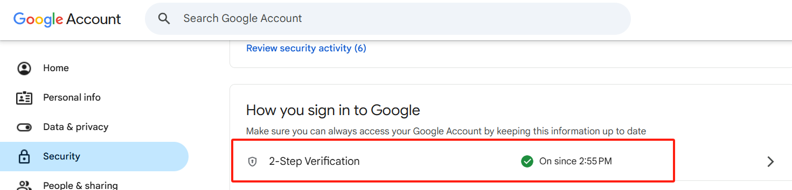
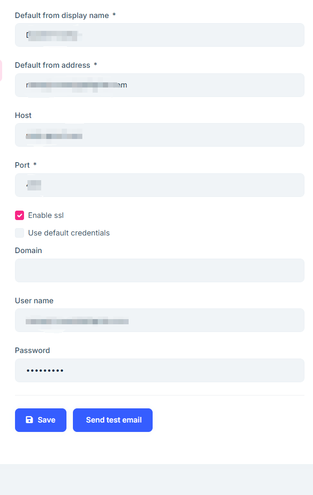

# メール設定

ウェブサイト登録時に入力したメールアドレスは、登録確認やガイド手配などの通知メールの送信元として使用されます。

Gmailを使用してシステムメールを送信する場合、安全かつ確実に送信できるよう、Gmailの「アプリ パスワード」を管理画面で設定する必要があります。

## 1. アプリ パスワードを有効にする

1. Googleアカウントにログインし、【セキュリティ】設定ページへ移動します。「2段階認証プロセス」のセクションでクリックして進みます：

2. 2段階認証の設定ページの下部にある【アプリ パスワード】をクリックし、案内に従ってパスワードを生成します。

3. 生成されたパスワードを保存しておいてください。

## 2. メール情報の入力とテスト送信

トップページの右側【システム設定】から「ウェブサイトメール」を選び、設定ページを開きます：

- 先ほど生成したアプリパスワードを「パスワード」欄に入力します。
- 入力後【保存】をクリックします。
- 【テストメールを送信】ボタンをクリックし、設定が正しく完了しているか確認してください。

Gmailのアプリ パスワード設定が完了すると、システムは各種通知メールを正常に送信できるようになります。
