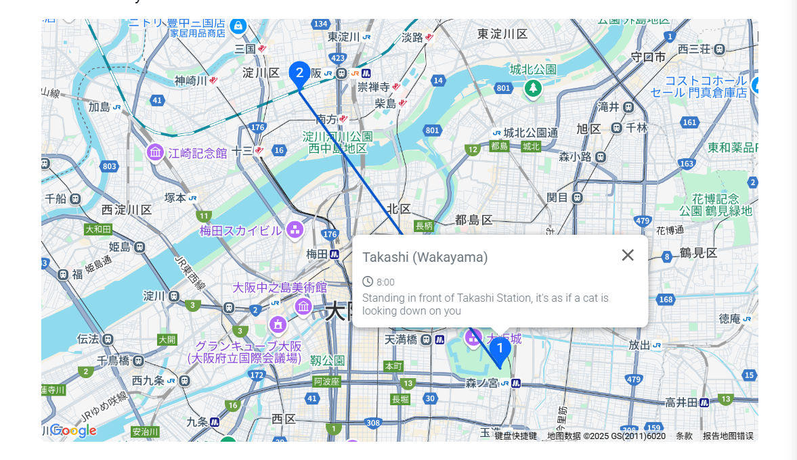

# ツアー

**ツアー** モジュールは、旅行サイトの中心的なコンテンツ表示エリアです。管理画面から行程の追加、予約情報や言語バージョンの設定を簡単に行い、お客様にわかりやすく便利な予約体験を提供できます。

## ツアーの編集

管理画面から **ツアーの追加/編集** を開きます。

編集前に、必ず希望する言語バージョンを選択してください。  
例：  
- 日本語を選択 → 日本語で内容を記入  
- 英語を選択 → 英語で内容を記入  
他の言語も同様です。

1. **行程**
   - 地図の選択  
     **編集/追加**ページの右側で、該当するサービスエリアを選択します。
     

     **行程住所**欄に行先名を入力し、右側の**選択**ボタンをクリック。地図が表示され、位置を確認してから**確認**を押します。
     

     選択された地図の位置は、フロントエンドのツアー詳細ページに表示されます。  
     1つの行程に対して1地点、1つのツアーには複数の行程地点を設定可能です。

2. **予約日**
   - 事前予約可能日数  
     例：0日 → 当日予約可能。明後日が最終予約日なら、事前予約は2日。

   - 予約時間の種類
     - 特定日指定  
       例：2025年6月1日、6月4日、6月7日などの個別日を設定。
       

     - 期間指定  
       年/月/週単位で期間を指定可能。例：  
       毎年230日目〜300日目、毎月10日〜20日、毎週金〜日など。
       

     - 時間制限なし  
       終了日を設定せず、今日から無期限で予約可能。

## ツアーの表示確認

編集完了後、サイト上で公開されたツアーを確認できます（カード表示と詳細ページ）。

1. 行程  
   設定した行程ポイントと順番が表示され、お客様にルートを明確に伝えられます。
   

2. 返金ポリシー  
   管理画面で設定した**返金説明**が、顧客が返金を申請した際に表示され、自動的に返金金額を計算します。

3. 予約日  
   管理画面で設定した予約タイプに応じて、フロントエンドで選択可能な日程が表示されます。
   

これで、ツアーコンテンツの作成と管理方法を把握できました。情報の正確性と完全性を保つことで、お客様の体験をさらに向上させることができます。不明点がある場合は、他のヘルプ文書をご参照ください。
