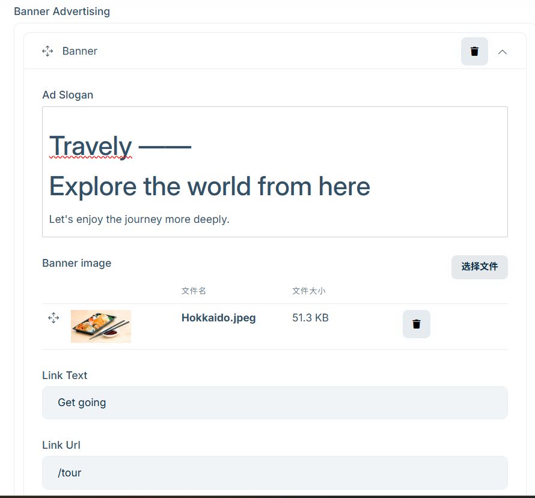
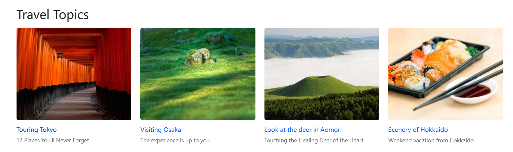

# サイトページ

「サイトページ」モジュールでは、ホームページ、会社概要、お問い合わせなどのコンテンツページを自由に編集できます。企業の魅力を伝え、顧客体験を向上させ、検索エンジンでの可視性を高めるのに役立ちます。本ガイドでは、ページ内容とSEO設定の方法を説明します。

## ページ編集の入り口

管理画面左側メニューの【コンテンツ管理】から、ページ編集画面にアクセスします。

ページ内容は、以下の2つの主要セクションに分かれています：

## 1. 入力フィールド内容の編集

あらかじめ用意された入力フィールドにより、「ホーム」「会社概要」「お問い合わせ」のページ内容を編集できます。

### ホーム

1. **サイトスローガン**  
   リッチテキストエディターを使ってスローガンを入力します。ホームページ上部に表示されます。  
   

2. **バナー広告**  
   タイトル、副タイトル、通し画像を設定します。リンクは固定で、ホームページの下部に表示されます。  
   

3. **ツアーテーマ**  
   地域ごとの特色あるテーマを入力し、ユーザーが行程を効率よく探せるようにします。  
   

4. **おすすめツアー**  
   注目のツアーを表示し、露出や予約のコンバージョン率向上に貢献します。  

### 会社概要（About Us）

1. 会社スローガン  
2. 会社紹介  
   - テキスト内容  
   - 画像ギャラリー  

### お問い合わせ（Contact Us）

1. スローガン  
2. 会社名  
3. メールアドレス  
4. 郵便番号  
5. 会社住所  
6. マップリンク（GoogleマップのURL）  
7. SNSリンク  

## 2. SEO 設定

SEO（検索エンジン最適化）により、サイトが検索結果に表示されやすくなります。以下の項目を編集できます：

- **ページタイトル**  
  検索結果に表示されるページのタイトル。短く要点を押さえて書きましょう。

- **ページ説明**  
  検索結果のタイトル下に表示される説明文。簡潔で魅力的に書くことがポイントです。

- **ページ画像**  
  サイトの印象を良くする代表的な画像をアップロードしましょう。

> 補足：管理画面の【コンテンツ管理】>【設定】内の項目はシステムデフォルトです。手動での編集は不要です。

---

ページ内容とSEO設定を適切に行うことで、サイトの魅力を高め、顧客の信頼を得て、検索エンジンでの順位向上にもつながります。
