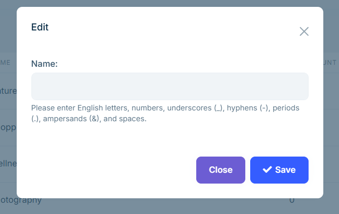

# 类型和地区

**类型**和**地区**有助于清晰分类游览项目，方便客户快速筛选和查找。您可在后台灵活设置，提升网站浏览与预订体验。

## 编辑

在后台左侧菜单中进入`游览管理`，点击 `地区`页面可进行以下操作：

- 点击页面右上角的【从预设添加】，选择系统预设的地区。

- 点击【新建】按钮，在弹出框中手动输入地区名称。

**注意** ：当前仅支持英文输入，暂不支持多语言。名称可包含字母、数字、空格、下划线 `_`、短横线 `-`、与符号 `&` 等。

在`类型`页面，操作方式与`地区`页面相同。

## 显示

网站前端将展示您设定的类型与地区信息，主要体现在以下模块：

- 首页的**旅游专题**区域。
  
- **游览**页面的筛选条件。
  
- **游览详情**页面的类型与地区标签。

这些信息能有效提升客户查找效率，帮助其快速定位感兴趣的游览项目。

---

合理设置类型与地区可优化网站结构，提升客户查找效率。建议在创建游览时及时配置，确保前端信息完整准确。
