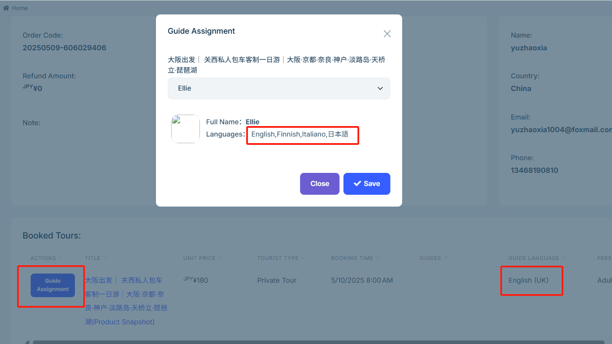
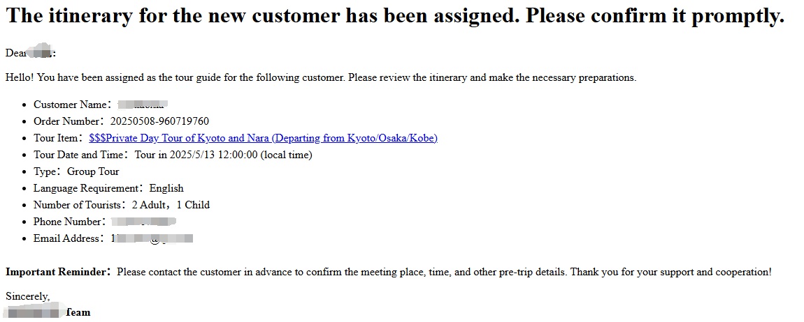

# 安排导游

为了确保客户拥有良好的游览体验，系统支持您根据客户预订时选择的语言，为每个行程安排合适的导游。本指南将帮助您高效完成导游分配、通知以及后续沟通流程。

## 导游语言

导游语言是导游与客户沟通时使用的主要语言。在安排导游时，请务必匹配客户所选语言，确保顺畅交流。

客户在预订时会选择期望的导游语言。订单生成后，您可在后台【订单管理】中，对每个**已付款**订单的游览项目分配具备相应语言能力的导游。

## 导游收到邮件

导游分配完成后，系统将自动发送一封邮件给导游，包含订单相关信息，提醒其已被指派接待该客户。

## 导游确认信息

导游收到邮件后，请及时使用邮件中提供的客户联系方式（手机号或邮箱）与客户确认集合时间、地点及其他行前安排，确保行程顺利进行。

---

合理分配导游并确保及时沟通是优质服务的关键。请根据客户语言需求慎重选择导游，确保每一次接待都专业、顺畅。如有更多操作疑问，欢迎查阅相关帮助文档。
