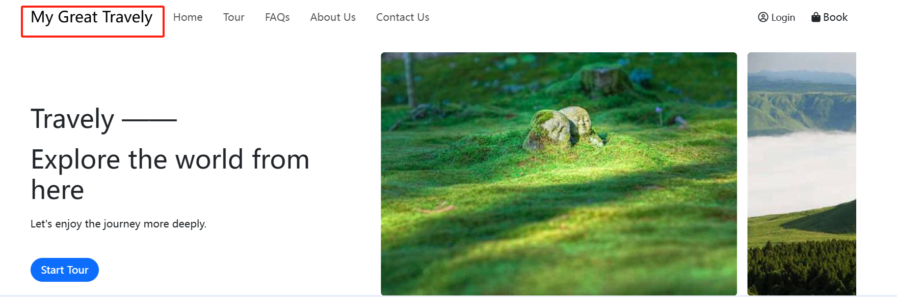

# 品牌设置

为了打造统一、专业的视觉形象，您可以在后台设置品牌名称、Logo、反色Logo与网站图标（Icon）。这些品牌元素将在网站前端的多个位置展示，帮助用户快速识别并记住您的品牌。

## 品牌名称

在此处设置的品牌名称将显示在网站端页面顶部，有助于用户快速识别网站归属：

## Logo 设置

品牌 Logo 是品牌形象的重要组成部分，系统将在以下位置展示您的 Logo：

- 网站顶部导航栏品牌名称左侧；
- 网站底部左侧

## 反色Logo

反色 Logo 适用于深色背景，确保 Logo 在不同背景下依然清晰可见，保持视觉一致性。

**白色背景下** 显示默认logo：

**黑色背景下** 自动切换为反色logo：

建议上传与默认 Logo 样式一致、颜色反差明确的反色版本。

## 网站图标(Icon)

Icon 是功能识别图标，常用于浏览器标签页、快捷方式图标等。它与 Logo（品牌识别）不同，但同样重要。

- 建议格式：ICO、PNG、SVG
- 推荐尺寸：16px × 16px

完成品牌设置后，您的网站将呈现出更专业一致的视觉形象，有助于增强用户信任与品牌识别度。若后续需要更新品牌信息，您可随时在后台进行修改，所有更改将实时同步至网站前端展示。
