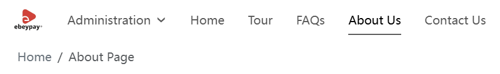

# 品牌设置

通过设置品牌名称、Logo、反色 Logo 和网站图标（Icon），可以提升网站的识别度与专业形象。以下是各项品牌元素的配置说明。

## 品牌名称

在此处设置的品牌名称将显示在网站端页面顶部，有助于用户快速识别网站归属：

## Logo 设置

品牌 Logo 是品牌形象的重要组成部分，系统将在以下位置展示您的 Logo：

- 网站顶部导航栏品牌名称左侧；
- 网站底部左侧

上传建议使用高分辨率的 PNG 或 SVG 格式，以确保清晰度和展示效果。

## 反色Logo

反色 Logo 适用于深色背景，确保 Logo 在不同背景下依然清晰可见，保持视觉一致性。

**白色背景下** 显示默认logo：

**黑色背景下** 自动切换为反色logo：

建议上传与默认 Logo 样式一致、颜色反差明确的反色版本。

## 网站图标(Icon)

Icon 是功能识别图标，常用于浏览器标签页、快捷方式图标等。它与 Logo（品牌识别）不同，但同样重要。

- 建议格式：ICO、PNG、SVG
- 推荐尺寸：16px × 16px

完善品牌设置有助于统一视觉风格，增强用户信任。
