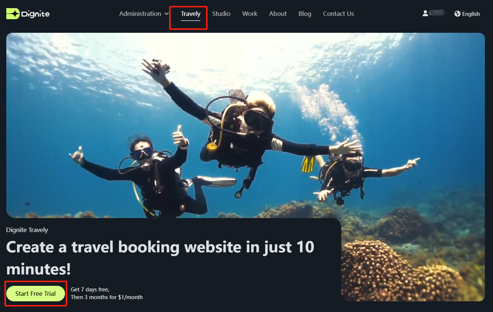
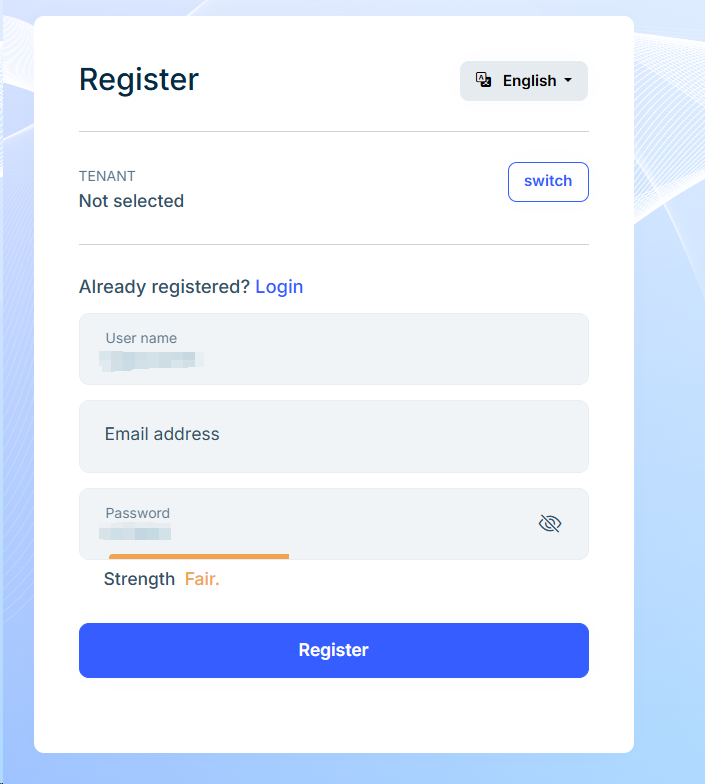
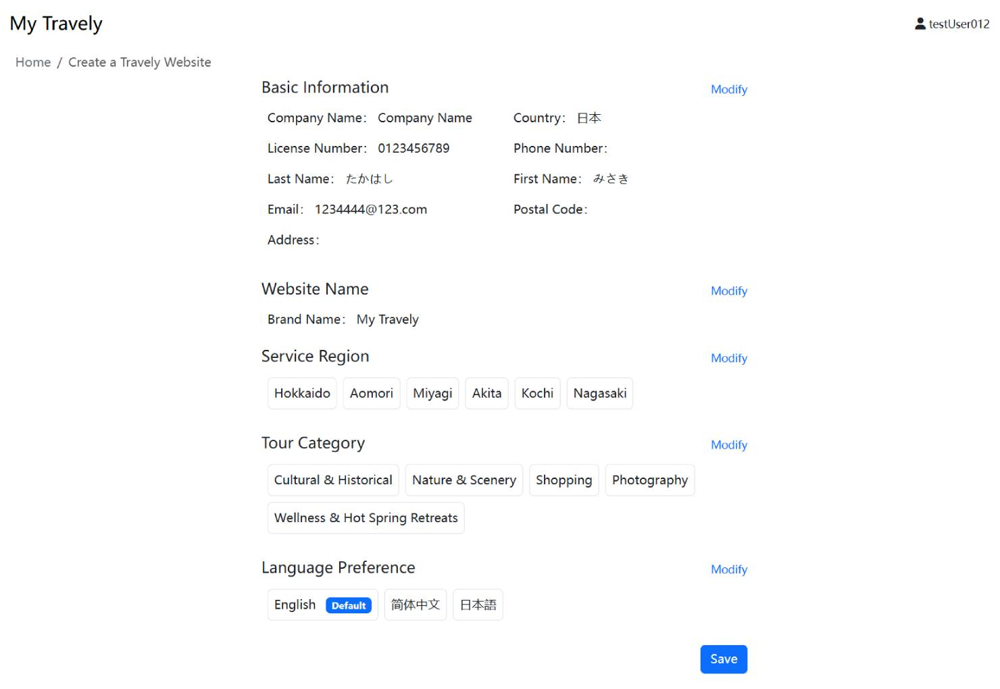

# 开通旅游网站

为了帮助旅游服务商快速搭建并运营属于自己的旅游网站，Dignite 提供了一个便捷、高效的建站平台。通过简单的注册、资料填写及配置步骤，您无需编程基础即可拥有一个支持多语言、在线预订和支付的专业旅游网站。本指南将带您逐步了解开通流程，从账号注册到后台配置，确保您顺利上线并开始接待客户。

## 开通步骤

开通旅游网站，请按以下步骤进行：

1. **开通入口**

    - 进入[官方网站](https://dignite.com),进入 **游览** 模块，点击 [立即开通](https://dignite.com/zh-Hans/travely)，开始创建您的旅游网站。
     

2. **登录/注册**

    - 若您已有账号，请直接登录。
    - 若您没有账号，请点击 **注册** 按钮，根据提示完成注册，也可以直接Google登录。
    

3. **填写资料**

    - 服务商基本信息。该信息提交后仍可在 `后台管理系统`中的 `旅游服务商资料`中去维护。
    - 为您的网站命名。该名称将显示在旅游网站首页左上角，并在所有页面中保持一致。如需修改，可在 `后台管理系统` > `设置` > `品牌` 中调整。
    - 选择服务地区。该地区将决定客户在网站中可浏览和预订的旅游项目区域。客户可在旅游网站的 **游览** 页面中，按服务地区筛选项目。
    - 选择游览类型。创建旅游项目时可为每个项目选择对应类型，方便客户按照兴趣查找。
    - 选择语言偏好。客户访问网站时将自动根据其所在地语言显示内容。您可在 `后台管理系统` > `本地化` 中编辑和维护各语言版本。

4. **提交资料**

    - 在最后一步中，点击**完成**显示如下页面，确定填写无误后点击**提交**按钮。
    

提交成功后显示如下页面，邮箱中会收到一封系统邮件包含后台管理系统的登录地址、账号及初始密码。

---

## 进入后台

进入后台管理，点击 **1** 可进入默认的旅游网站页面，您可以提前浏览网站内容。点击 **2** 即可进入登录页面，输入账户和密码进入首页。
点击 **3** 可更换后台网站的语言系统，比如默认显示的是中文，您可以切换成英文。

根据首页的提示，完成相关配置。

 **1** **服务指南**

- 基本信息
  内容与开通步骤的**填写资料**中的**服务商基本信息**一致。您可以在此补充或修改。
- 在线支付
  请按说明开通在线支付,这一步非常重要，关系到您的收入。具体操作请参考[在线支付](Online-Payment.md)
- 旅游信息
  具体操作可以参考**旅游管理**操作说明。
- 正式使用
  操作完以上步骤您就可以尝试正式使用您的网站了。

 **2** **基本信息**
您在 **1** 中填写的资料在这个模块都可以看到，当然也可以在此处修改。

 **3** **系统配置**

- 网站域名
  您可以自定义您的网站域名，有疑问可参考[域名设置](Domain-Settings.md)
- 网站邮箱  
  在这里您可以更改您的网站邮箱
- 账户管理
  和 **1** 中的**在线支付**是相同的。
- 网站语言
  本地化的语言设置，点击右侧的`语言管理`按钮，去选择网站允许使用的语言。
- 服务期限
  您的网站在免费开通后，有三天的免费试用期，之后，您需要支付一定的费用才能继续使用，这个服务期限既是显示您服务到期的日期。

  ---

至此，您已完成旅游网站的开通与基础设置。通过后台管理系统，您可以持续优化网站内容、更新旅游项目、拓展服务区域，并提升客户体验。如果在操作过程中遇到问题，欢迎查阅各模块的详细使用文档或联系技术支持团队协助。祝您在数字化旅游业务中取得圆满成功！