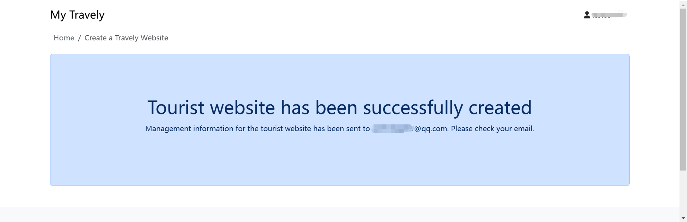

# 开通旅游网站

开通旅游网站非常简单。只需按照以下步骤操作，即可搭建一个支持在线预订的专业旅游平台。请前往[官方网站](https://dignite.com),进入 **游览** 模块，点击 [立即开通](https://dignite.com/zh-Hans/travely)，开始创建您的旅游网站。

## 填写旅游服务商基本信息

请根据实际情况填写您的服务商信息，标有 * 的为必填项。该信息提交后仍可在 `后台管理系统`中的 `旅游服务商资料`中去维护。

## 为网站命名

请输入您网站的名称，该名称将显示在旅游网站首页左上角，并在所有页面中保持一致。
如需修改，可在 `后台管理系统` > `设置` > `品牌` 中调整。

## 选择服务地区

请选择您提供旅游服务的地区。目前仅支持日本境内。
所选地区将决定客户在网站中可浏览和预订的旅游项目区域。客户可在旅游网站的 **游览** 页面中，按服务地区筛选项目。

## 挑选游览类型

请选择您所提供的游览类型（可多选），例如：**文化历史游**、**美食之旅**、**自然风光游**、**城市深度**游 等

创建旅游项目时可为每个项目选择对应类型，方便客户按照兴趣查找。

## 选择语言偏好（本地化）

请选择您的语言偏好，可设置默认语言及多个支持语言。
客户访问网站时将自动根据其所在地语言显示内容。您可在 `后台管理系统` > `本地化` 中编辑和维护各语言版本。

## 确认填写内容

请再次检查所有已填写的信息。若需修改，请点击相应字段旁的 **修改** 按钮。

## 提交并完成开通

确认无误后，请点击 **提交** 按钮。系统将跳转至如下页面：

同时，您将收到一封系统邮件，邮件将发送至您在“基本信息”中填写的邮箱，内容包含后台管理系统的登录地址、账号及初始密码。
