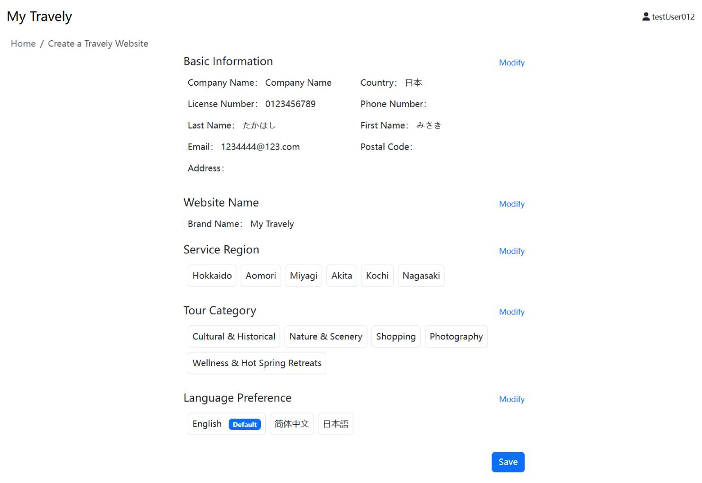

# 开通旅游网站

为了帮助旅游服务商快速搭建并运营属于自己的旅游网站，Dignite 提供了一个便捷、高效的建站平台。通过简单的注册、资料填写及配置步骤，您无需编程基础即可拥有一个支持多语言、在线预订和支付的专业旅游网站。本指南将带您逐步了解开通流程，从账号注册到后台配置，确保您顺利上线并开始接待客户。

## 开通步骤

请按照以下步骤完成旅游网站的开通：

1. **开通入口**

   - 访问 [官方网站](https://dignite.com),进入 **游览** 模块，点击 [立即开通](https://dignite.com/zh-Hans/travely)，开始创建您的旅游网站。
     
2. **登录/注册**

   - 若您已有账号，请直接登录。
   - 若尚未注册账号，请点击 **注册** 按钮，按照提示完成注册流程，或使用 Google 账号快捷登录。
     
3. **填写资料**

   - 服务商基本信息。
   - 为您的网站命名。
   - 选择服务地区。
   - 选择游览类型。
   - 选择语言偏好。

     
4. **提交资料**

   - 在最后一步中，点击 **完成** 后将看到如下页面，确定填写无误后点击**提交**按钮。
     

资料提交成功后，系统将发送一封邮件至您的注册邮箱，内含后台管理系统的登录地址、账号及初始密码。

---

## 进入后台

进入后台管理系统后，请根据首页提示完成相关配置。

> **注意**  ：首页中只有**网站域名**、**网站邮箱**、**在线支付** 配置完成后才视为**正式开通** 。

 **服务指南**

- 基本信息
  与开通步骤的**填写资料**中的**服务商基本信息**一致。您可以在此补充或修改。
- **在线支付**
  请提前准备一个日本手机号，用于账户的验证和两步验证过程，以增强账户的安全性，其他国家手机号不可用。
  请按照说明完成在线支付配置，这一步对收款非常关键。详细操作请参考[在线支付](Online-Payment.md)
- 游览信息
  具体操作可以参考**游览管理**操作说明。

**基本信息**

    您在**服务指南**中**基本信息模块**填写的资料将在此模块中展示，并支持随时修改。

 **系统配置**

- **网站域名**
  您可以自定义您的网站域名，详情参阅[域名设置](Domain-Settings.md)
- **网站邮箱**
  支持修改绑定的站点邮箱地址,这个地址用于接收系统通知及给客户和导游发送邮件，如若确保顺利给客户发送邮件同时能更好的保护您邮箱的主密码安全，可参考[邮箱设置](Email-Settings.md)完成相关配置
- **账户管理**
  与 **服务指南** 中的**在线支付**设置内容一致。
- 网站语言
  支持多语言设置，可通过点击右侧的 `语言管理`按钮，选择网站允许显示的语言版本。

至此，您已完成旅游网站的开通与基础设置。
如果在操作过程中遇到问题，欢迎查阅各模块的详细使用文档。
祝您在数字化旅游业务中取得圆满成功！
