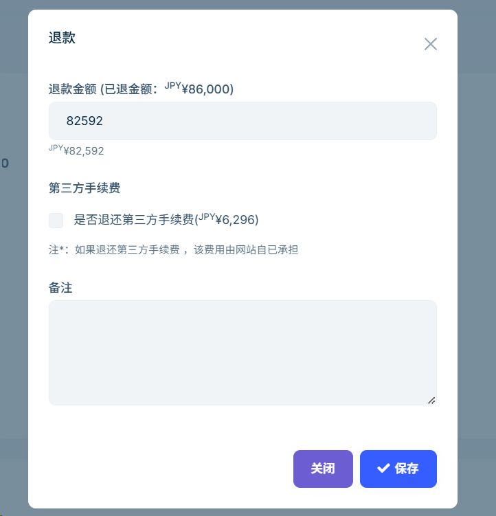

# 客户退款

客户退款操作由系统自动计算退款金额，无需手动干预。客户发起退款后，系统会以您的名义发送退款通知邮件。本指南将帮助您了解退款的处理方式、计算规则及注意事项，确保退款流程顺畅高效，提升客户服务体验。

## 快照说明

系统会在客户下单时自动保存游览页面的**快照**，包括标题、价格、描述、图片等信息。您可在后台【订单】详情页的【预订的游览】列表中点击**标题**，查看该订单对应的页面快照。

## 退款时间

是否允许退款，取决于订单中每个游览设置的**退款说明**中的时间来决定。

## 退款方式

- **客户自主退款**：客户可登录网站，在订单详情中点击【退款】按钮，直接提交退款申请。
- **商户代为退款**：客户亦可通过网站提供的联系方式（电话或邮箱）联系您，您可在后台【订单】列表中找到对应的订单编号，进入详情页，点击【退款】按钮进行退款申请。
  
  > 注意：网站端每笔订单仅支持客户申请一次退款，但后台可由您多次发起退款操作。

  

## 手续费说明

- 网站端退款不包含第三方平台（Stripe）手续费。
- 后台退款可退还第三方手续费，具体金额由 Stripe 收费政策决定

## 金额计算公式

退款金额 = 付款金额（可退款的游览）X 退款比例 - 第三方手续费

## 退款记录

所有退款操作及金额记录可在后台【订单】详情的退款信息列表中查看。

---

请确保在处理退款前仔细核对订单信息和退款政策，妥善保留每笔退款记录。
