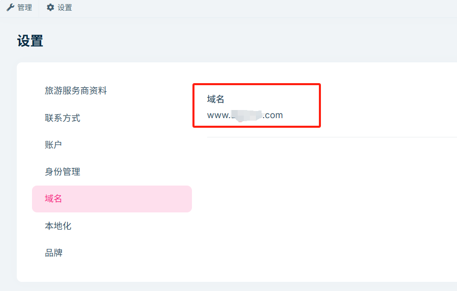
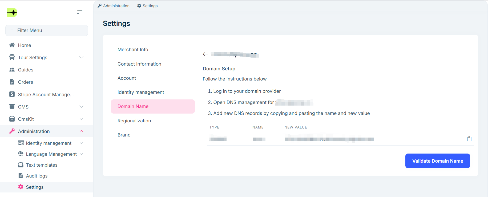

# 域名设置

为了提升您网站的专业形象与访问便利性，建议您为网站配置自定义域名。本指南将帮助您快速完成域名选择与DNS解析设置，确保您的域名能够顺利指向网站并正常使用。

## 自定义域名名称

**域名选择**

- **简短易记**   尽量使用简洁、易于输入的域名，避免过长或复杂的字符组合。
- **品牌关联性** 尽量选择与网站主题或品牌相关联的域名，以提高辨识度和记忆性。
- **语言适配**   使用英语作为关键词为主的域名，根据目标受众的语言习惯进行选择。

## DNS配置

 1. 首次添加域名时，您需要前往【域名服务商】购买域名，并根据其提供的步骤完成 DNS 设置。以下以 [Onamae.com](https://www.onamae.com/) 为例，说明如何完成 DNS 解析记录的配置。

    **购买域名：**
    - 访问 [Onamae.com](https://www.onamae.com/) 官网，注册或登录账号。
    - 在域名搜索框输入想要注册的域名，选择后缀，查询是否可注册。
    - 若可注册，加入购物车，填写注册信息，完成支付。

    **设置DNS:**
    - 登录 [Onamae.com](https://www.onamae.com/) 账号，进入管理中心。
    - 点击导航栏第一个选项，选择`设置名称服务器`。
    - 选择需要修改DNS的域名，点击`其他`。
    - 填入自定义的DNS服务器地址，点击`验证`

 2. 用户后续修改自定义域名时，请根据下图提示，更新 DNS 解析记录：

>域名配置完成后，系统将自动检测域名是否可用，并绑定至您的网站。

## 效果预览

配置成功后，您的网站将通过新的自定义域名访问，效果如下：

通过配置自定义域名，您不仅可以提升网站的专业度，还能增强品牌辨识度和访问体验。若在设置过程中遇到任何问题，建议联系域名服务商客服获取支持。
