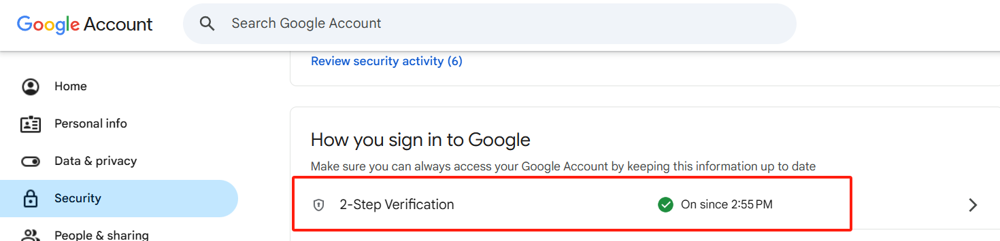
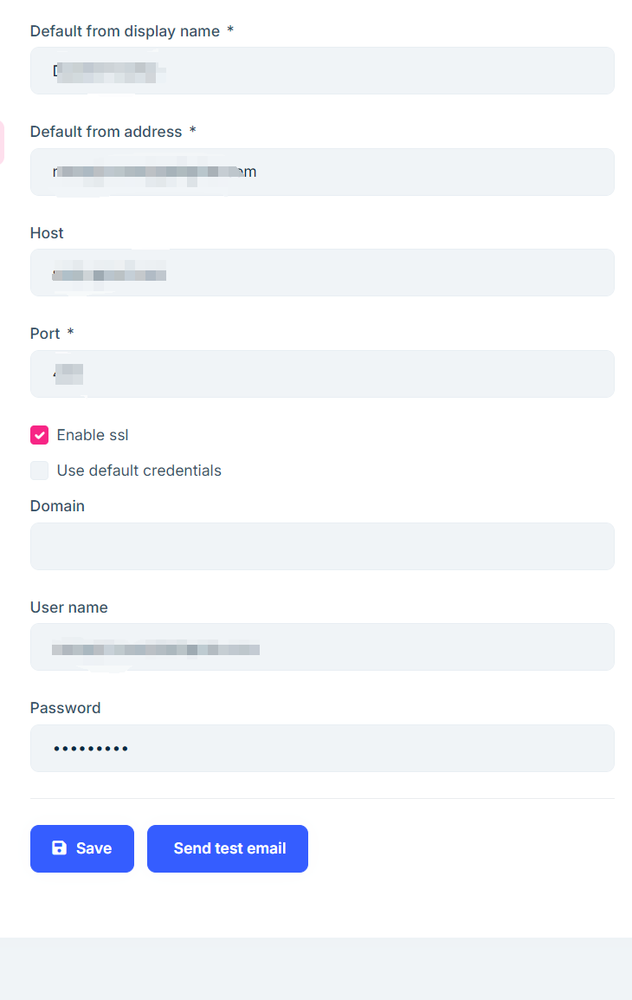

# 邮箱设置

为了保障账号安全，同时确保系统邮件（如订单通知、注册验证等）能够正常发送，建议您为网站配置第三方邮箱服务。无论是Gmail、163邮箱还是QQ邮箱，大多数主流邮箱服务商都支持**应用专用密码**功能，有效提升了邮箱发送安全性和稳定性。

## 一、开启应用专用密码

以下以配置Gmail为例，介绍如何开启应用专用密码：

1. 登录您的 Google 账号，进入【安全性】设置页面，在“两步验证”部分点击进入：

2. 在“两步验证”设置页面底部找到【应用专用密码】，点击进入并根据提示生成专用密码。

3. 将生成的密码保存备用。

## 二、填写邮箱信息并测试

从首页右侧的【系统配置】中找到**网站邮箱**，进入设置页面：

- 将刚刚生成的专用密码填入【密码】栏位
- 完成填写后点击【保存】
- 可点击【发送测试邮件】按钮，以确认邮箱配置是否成功。

通过配置应用专用密码并正确填写邮箱信息，您将能够安全、稳定地发送系统邮件，提升用户沟通效率与网站可靠性。如果在操作过程中遇到问题，欢迎查阅各模块的详细使用文档。
