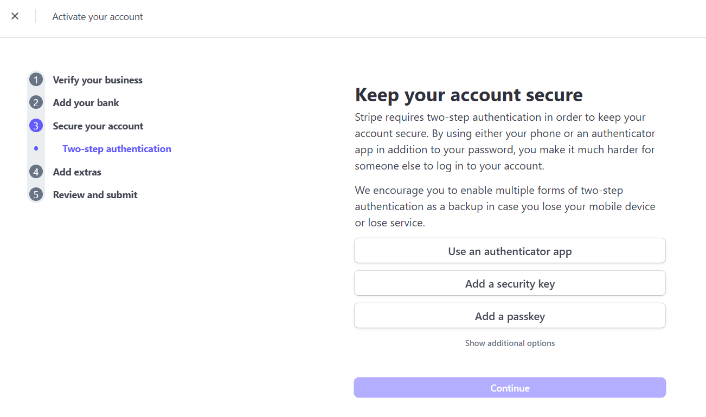

# 支付账户

为了让您能够顺利接收客户付款并保障账户资金安全，**Dignite Travely 与 Stripe 合作**，为商户提供可靠、高效的支付服务解决方案。本页将引导您了解支付账户设置的相关内容和功能模块。

> Stripe 是全球领先的支付处理公司，为各类在线平台提供安全便捷的支付接口与结算服务。

## 开通在线支付

请在首页的【服务指南】中点击**开通在线支付**，并按以下步骤完成 Stripe 账户的开通与激活：

### 一、验证邮件地址

- 访问[Stripe 官网](https://stripe.com/en-jp)
- 点击**Sign Up**或**注册**，填写基本信息（邮箱、密码等）
- 验证邮箱后登录账户

### 二、使用沙盒环境测试

- Stripe 提供沙盒测试环境，可预览账户余额、交易记录、客户信息等内容
- 您可在沙盒中熟悉各项功能，无需真实付款操作。

### 三、激活正式账户

您可通过以下方式进入 **Stripe** 账户激活页面：

- 点击沙盒右上角的【获取您的真实账户】按钮
- 或点击右下角的设置引导中的【填写您的资料】

根据提示填写您的公司/个人信息，完成账户激活。

**注意**：

1. **两步验证**必须使用**日本手机号**，其他国家号码不可用。

2. Stripe中填写的**商家名称**需与**网站名称**一致

3. 网站旅游项目需要完善后再审核Stripe

4. 日本法律要求, 网站需添加**特定商取引法に基づく表記**链接

## 后台支付功能说明

开通 Stripe 后，您可以通过网站后台左侧导航栏的【Stripe账户】模块进行管理：

### 账户登录

- 登录您的 Stripe 账户以完成身份验证。
- 验证通过后，即可正式启用 Stripe 支付服务，接收客户付款。

### 提现记录

- 查看历史提现记录，包括时间、金额及到账状态。

### 付款明细

- 跟踪每一笔用户支付的详细记录，便于财务管理与对账

### 文件下载

- 下载与支付账户相关的文件。

### 税务信息

- 填写和更新您的税务地址与税务代码，以满足合规要求。

完成 Stripe 支付账户的设置后，您将能够顺利收款、管理财务，并确保交易合规安全。如果在设置过程中遇到任何问题，请参考 Stripe 的官方帮助中心。
