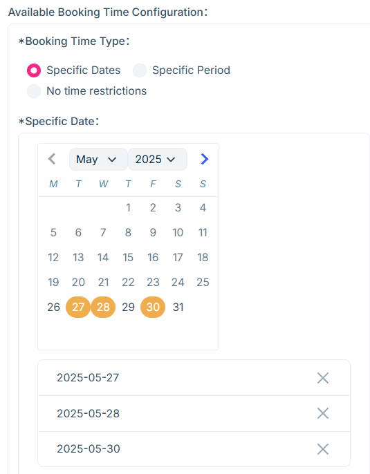

# 游览

**游览** 模块是旅游网站的核心内容展示区。您可以通过后台轻松添加行程、设置预订信息和语言版本等等，为客户提供清晰、便捷的浏览与预订体验。

## 编辑游览

在后台管理系统中去**添加/编辑**游览。

编辑前，请先选择语言版本，然后点击进入编辑页面。

1. **行程**
   - 地图选点
     在**编辑/添加**页面的右侧选择该行程所属的服务地区
     

     在**行程地址**区域输入行程地点名称，点击右侧**选择**按钮，弹出地图后确定输入地址的位置，点击确认
     

     选择完成后，地图位置将显示在网站前端的游览详情中，供客户参考。每个行程都可选择一个地点，每个游览都可以有多个行程地点。

2. **预订日期**

   - 可提前预订天数
     可提前预订的天数：可提前0天，即当天可预订；如果后天是预订的最后一天，那么可提前预订2天。

   - 预订时间类型

     - 指定日期
       手动选择具体可预订的日期，如2025-06-01、2025-06-04、2025-06-07等
       

     - 指定周期
       可按年/月/周设定范围，如：每年的第230天到300天；每月的第10天到第20天；每周的第五天到第七天等。
       

     - 无时间限制
       不设结束时间，默认从今日起可长期预订。

## 查看游览

完成编辑后，您可在网站端查看已发布的游览项目，包括卡片展示和详情页内容

1. 行程

   客户可在网站端查看您设置的多个行程点及其时间顺序，清晰了解路线安排。
   

2. 退款说明
   后台设置的**退款说明**，将在客户发起退款时展示，并按说明自动计算退款金额。

3. 预订日期
   网站端将根据后台设置的预订类型，显示对应的可选择日期。
   

至此，您已了解如何创建和管理游览内容。请确保信息准确完整，以提升客户体验。如有疑问，可参考其他文档。
