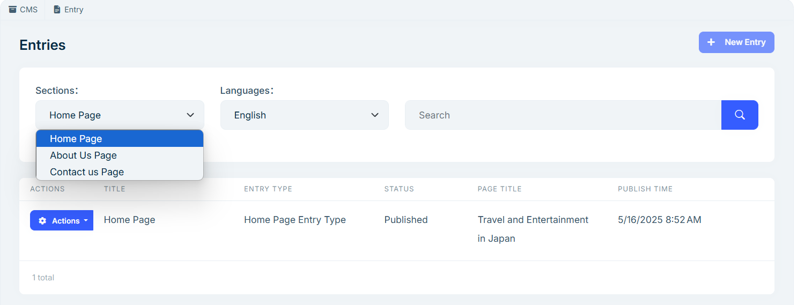
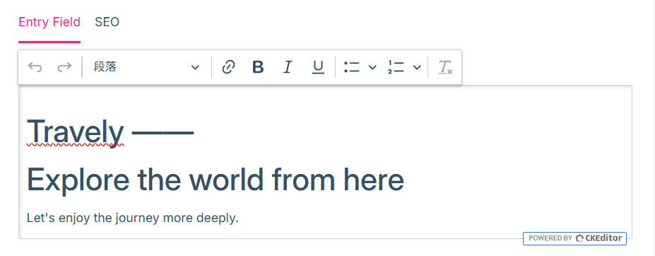

# 网站页面

网站页面模块让您能够自定义网站首页、关于我们、联系我们等内容页面，有助于更好地展示企业特色、提升客户体验，同时增强搜索引擎可见性。本指南将帮助您了解如何编辑页面内容及设置基础 SEO 信息。

## 页面编辑入口

您可以通过后台左侧菜单【内容管理】进入页面编辑界面。

页面内容分为两个主要模块：

## 一、输入字段内容编辑

根据预设字段，您可以自由编辑首页、关于我们、联系我们页面内容。

### 首页

1. **网站标语**

   在可编辑区域中使用富文本编辑器输入标语内容，展示于网站首页顶部。

   

2. **横幅广告**

    设置大标题、副标题和通栏图片，跳转链接为固定链接，横幅显示于首页底部。

   

3. **游览主题**

    可输入不同地区的特色主题，便于客户快速浏览和筛选行程。

    

4. **推荐旅游**

    可按季节推荐合适的旅游项目，吸引客户点击和预订。

### 关于我们

1. 公司标语
2. 公司介绍
   - 文本内容
   - 图片集

### 联系我们

1. 标语
2. 公司名称
3. 邮箱地址
4. 邮政编码
5. 公司地址
6. 公司地图位置（网址）
7. 社交媒体链接

## 二、SEO 设置

SEO（搜索引擎优化）有助于提高网站在搜索结果中的曝光率。以下是可编辑的 SEO 相关字段：

- **页面标题**

    页面在搜索引擎中的显示标题，建议清晰简洁，概括页面核心内容。

- **页面描述**

    页面在搜索引擎中显示在标题下方的简短介绍，应简明有吸引力，便于吸引点击。

- **页面图片**

    推荐上传具有代表性、视觉吸引力的图片，提升网站在搜索结果中的吸引力。

---

> 说明：在后台左侧菜单中【内容管理】的**设置**为系统默认配置，无需手动修改。

通过合理设置页面内容和 SEO 信息，您不仅能增强网站展示效果，还能提升客户信任度与搜索引擎排名。
